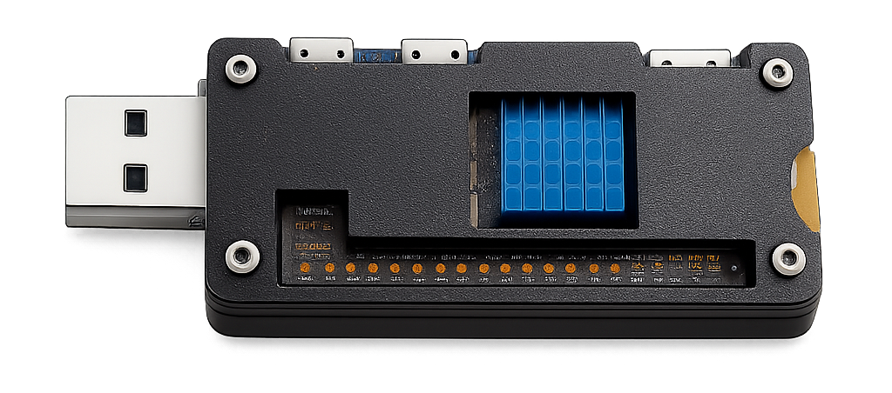
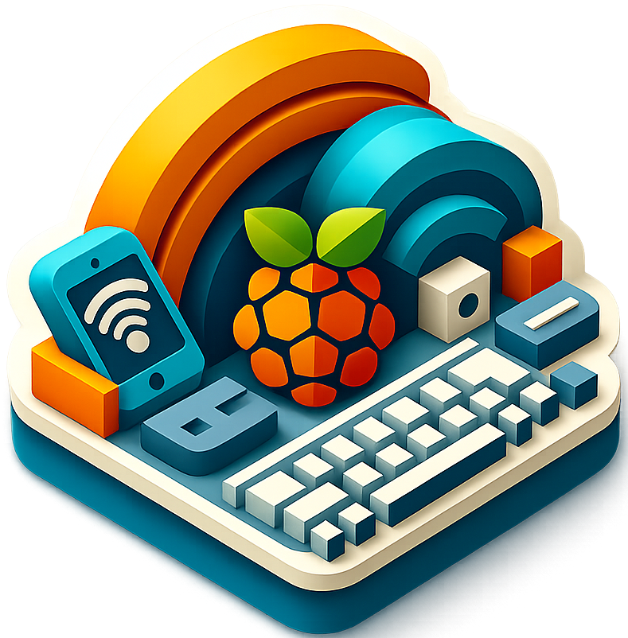

# 🧊 Ice Pi  
**A mobile GNU/Linux network offense & defense platform**

<center></center>

Ice Pi is a **GNU GPL–licensed**, mobile-controlled **Kali Linux–powered network security device**.  
It is designed for people who **break networks to understand them** — and for those who want to **carry a trusted network with them everywhere**.

Ice Pi turns a single portable device into:
- A full red-team / penetration-testing platform  
- A hardened personal network gateway for hostile environments  

No cloud. No lock-in. No black boxes.

---

## ⚠️ Legal & Ethical Use

Ice Pi is intended for:
- Authorized penetration testing
- Security research and education
- Network hardening and privacy protection
- Personal device security on untrusted networks

You are responsible for how you use it.  
Do not target networks or devices without explicit permission.

---

## 🔴 Offensive Security (OffSec)

Ice Pi is **not** a toy device or a limited attack gadget.  
It runs **full Kali Linux**.

**Offensive capabilities**
- USB HID emulation (keyboard / mouse)
- Rubber Ducky–style payload execution
- USB mass storage emulation
- Rogue access points and Wi-Fi spoofing
- Network traffic interception and takeover
- Wi-Fi jamming*  
- Payload-driven automation
- Mobile-controlled red-team operations

If a tool runs on Kali, it runs on Ice Pi.

---

## 🛡️ Network Safety & Privacy

Ice Pi is also a **portable network firewall**.

It allows you to:
- Route all connected device traffic through:
  - Secure VPN
  - Tor
- Spawn isolated, hardened Wi-Fi networks
- Act as a trusted gateway on public Wi-Fi
- Shield laptops and phones from hostile networks
- Block ads, trackers, and malicious domains at the network level
- Inspect and control traffic before it reaches your devices

You don’t connect to networks.  
You **bring your own**.

---

## 🔄 One Device, Two Mindsets

Ice Pi is built on the idea that **offense and defense are the same discipline**.

- Simulate hostile networks  
- Defend against hostile networks  
- Test assumptions  
- Control your traffic  

Everything is local. Everything is auditable.

---

## 🆚 Comparison

| Feature | **Ice Pi** | Hak5 Devices | P4wnP1 |
|------|-------|--------|--------|
| GNU GPL Licensed | ✅ | ❌ | ❌ |
| Fully Open | ✅ | ❌ | ✅ |
| Mobile App Control | ✅ | ⚠️ Limited | ❌ |
| Full Kali Linux | ✅ | ❌ | ⚠️ Partial |
| USB HID Attacks | ✅ | ✅ | ✅ |
| Rubber Ducky Support | ✅ | ✅ | ✅ |
| Rogue AP / Spoofing | ✅ | ⚠️ | ⚠️ |
| Wi-Fi Jamming* | ✅ | ❌ | ❌ |
| Network Traffic Hijacking | ✅ | ⚠️ | ⚠️ |
| VPN Gateway | ✅ | ❌ | ❌ |
| Tor Routing | ✅ | ❌ | ❌ |
| Safe Public Wi-Fi Gateway | ✅ | ❌ | ❌ |
| Vendor Lock-in | ❌ | ✅ | ❌ |

\* Where legally permitted.

----- 

## ⚙️ Installation
On a fresh install of Kali Linux on Raspberry Pi, execute:
```
git clone https://github.com/toshithh/Ice-Pi.git
cd Ice-Pi
sudo chmod +x install.sh
sudo ./install.sh
```
The installer:
- Sets up the Kali Linux environment
- Configures USB gadget modes (HID, storage, USB Ethernet)
- Initializes networking, routing, and isolation
- Prepares Ice Pi for mobile control

\* A reboot may be required after installation.

---

## 📱 AnyKBoard - Mobile App
Ice Pi is controlled using the AnyKBoard mobile application.

<center></center>

The app is used to:
- Securely connect to Ice Pi
- Execute HID and payload actions
- Manage network modes (Offensive / Safe)
- Control VPN and Tor routing
- Monitor connected devices
- Toggle features in real time
- AnyKBoard is available on the Google Play Store.

Ice Pi is designed to be fully usable without a laptop.

All primary interactions happen through the mobile app.


---

## 🔐 Freedom by Design

- GNU GPL licensed
- No telemetry
- No forced updates
- No cloud dependencies
- No hidden firmware
- User controls every packet

---

## 📜 License

Ice Pi is licensed under the **GNU General Public License v3.0 or later**.

---

## ⚖️ Disclaimer

This project is provided **as-is**, without warranty.  
The authors are not responsible for misuse or illegal activity.
